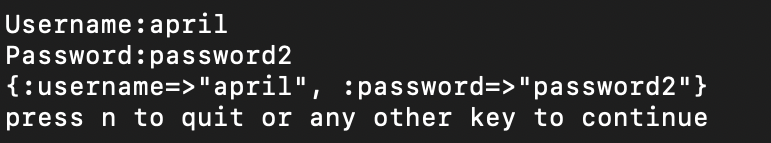
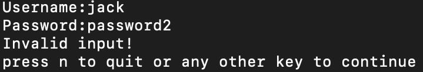

# CLI Authentication app
The ruby app takes in user input which is the username and password and mathes the input using the seeded data from an array.

If the user input mathes, then the CLI returns the correct hash.



If the user input is wrong, CLI return "Invalid Input"


I made use of Array & hashes, and used a ruby gem to test my code as go called ``pry`` and use ``VScode`` as my code editor

## Installation
[pry](https://github.com/pry/pry) 
### Manual
```
gem install pry
```
[VScode](https://code.visualstudio.com/)
